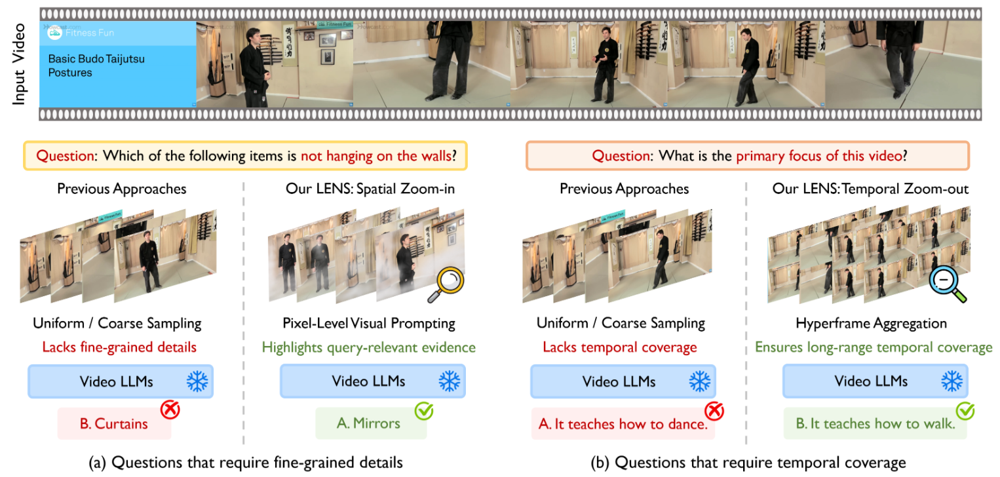
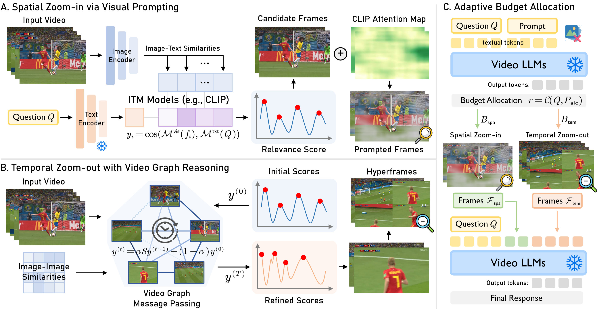

# [ECCV 2026] LENS: Adaptive Spatio-Temporal Zooming for Keyframe Sampling in Long-Form Videos

<p align="center">
<a href="https://zhangce01.github.io/LENS/" style="text-decoration:none"></a>&nbsp;&nbsp;<a href="https://arxiv.org/abs/2607.25125" style="text-decoration:none"></a>&nbsp;&nbsp;<a href="https://opensource.org/licenses/MIT" style="text-decoration:none"></a>&nbsp;&nbsp;<a href="https://eccv.ecva.net/" style="text-decoration:none"></a>&nbsp;&nbsp;<a href="https://pytorch.org/" style="text-decoration:none"></a>
</p>

## 🔥 News

- **[2026.07]** 📄 Our paper is available on [arXiv](https://arxiv.org/abs/2607.25125)!
- **[2026.07]** 🎉 LENS is accepted to **ECCV 2026**!
- **[2026.07]** 💻 Code is released. Try LENS on MLVU, Video-MME, LongVideoBench, EgoSchema, and NExT-QA!

## 👀 Introduction

This repository contains the code for our ECCV 2026 paper `LENS: Adaptive Spatio-Temporal Zooming for Keyframe Sampling in Long-Form Videos`.

LENS is a **training-free keyframe selection** pipeline for long-video question answering with large vision-language models (LVLMs). Different questions demand different evidence: some hinge on **fine-grained details** in a few frames (reading text, small objects, attributes), while others require **long-range temporal coverage** (main idea, event ordering, counting). A fixed sampling strategy cannot serve both.



Given a fixed frame budget, LENS lets the LLM itself decide — per question — how to split the budget between two complementary views of the video:

- **🔍 Spatial zoom-in**: full-resolution keyframes whose query-irrelevant regions are suppressed by CLIP attention masking, for detail questions.
- **🔭 Temporal zoom-out**: 2×2 *hyperframes* that pack an anchor frame with its temporal neighborhood into a single frame slot, for questions about events, ordering, and changes over time.

## 📢 Highlights

- 💡 We introduce **adaptive budget allocation**: a lightweight prompt asks the LVLM to output a single ratio `r` from the question alone — detail questions get more spatial zoom-in, temporal questions get more zoom-out. No training, no extra models.
- 🔥 **Spatial zoom-in via visual prompting**: watershed anchor selection over the ITM relevance curve picks temporally diverse peaks, and text-conditioned CLIP attention maps gray out regions irrelevant to the question, spending each frame's resolution on what matters.
- 🚀 **Temporal zoom-out with video graph reasoning**: frames are connected by pairwise SSIM into a video graph; manifold ranking `f ← βPf + (1−β)y` propagates relevance along the graph, suppressing isolated noisy peaks, and each selected anchor is composed with its neighborhood into a 2×2 hyperframe for long-range coverage.
- ⚡ LENS is **plug-and-play** with any LVLM (Qwen2-VL / Qwen2.5-VL, InternVL2.5, LLaVA-Video, LongVU) and evaluated on five long-video benchmarks.

## 🛠️ Method



**Pipeline.** (A) *Spatial zoom-in*: an ITM model (CLIP/BLIP/BLIP2) scores every frame against the question; watershed selection picks anchor peaks, and CLIP attention masking highlights query-relevant evidence. (B) *Temporal zoom-out*: relevance scores are refined by message passing on an SSIM-based video graph, and refined anchors are aggregated with their neighborhoods into hyperframes. (C) *Adaptive budget allocation*: a frozen video LLM reads the question and splits the frame budget `r : (1−r)` between the two branches; the merged, temporally ordered frames are fed to the LVLM for the final answer.

## 📂 Repository Structure

```
LENS/
├── runners/
│   ├── run_lens.py    # main method
│   ├── run_baseline.py# ITM retrieval baseline (top-scoring frames only)
│   ├── run_uniform.py # uniform sampling baseline
│   └── run_qframe.py  # fixed hierarchical budget baseline (1/2 raw, 1/4 2×2, 1/4 4×4)
├── utils/
│   ├── lens.py        # LVLM backend loader
│   ├── sampling.py    # scoring, SSIM graph, diffusion, watershed selection
│   ├── prompts.py     # LLM budget-allocation prompt
│   ├── data.py        # benchmark datasets and subtitle parsing
│   └── config.py      # command-line arguments
├── models/            # per-LVLM adapters (Qwen2-VL / Qwen2.5-VL, InternVL2.5, LLaVA-Video, LongVU)
├── API_CLIP/          # CLIP attention masking (adapted from API prompting / clip_prs)
├── fig/               # figures
└── scripts/           # torchrun launch scripts
```

## ⏳ Environment and Setup

```bash
conda create -n lens python=3.11
conda activate lens
pip install -r requirements.txt
# flash-attn is required by the Qwen-VL backend; install a wheel matching your CUDA/torch:
pip install flash-attn --no-build-isolation
```

The default backend is Qwen2.5-VL-7B-Instruct; BLIP (ITM) is used for frame relevance scoring and CLIP ViT-L/14-336 for attention masking. All models are downloaded automatically from Hugging Face on first run.

Optional backends need their own packages: LLaVA-Video (`llava`), LongVU (`longvu`).

## 🤗 Data Preparation

Download the benchmarks and arrange them as the loaders in `utils/data.py` expect:

| Task flag | Benchmark | Expected layout under `--data_path` |
|---|---|---|
| `mlvu` | [MLVU](https://huggingface.co/datasets/MLVU/MVLU) | `json/*.json`, `video/<subtask>/` |
| `videomme` | [Video-MME](https://huggingface.co/datasets/lmms-lab/Video-MME) | `videomme/test-00000-of-00001.parquet`, `data/*.mp4`, `subtitle/*.srt` |
| `lvb` | [LongVideoBench](https://huggingface.co/datasets/longvideobench/LongVideoBench) | `lvb_val.json`, `videos/`, `subtitles/` |
| `egoschema` | [EgoSchema](https://huggingface.co/datasets/lmms-lab/egoschema) | `Subset/test-00000-of-00001.parquet`, `videos/*.mp4` |
| `nextqa` | [NExT-QA](https://huggingface.co/datasets/lmms-lab/NExTQA) | `MC/test-00000-of-00001.parquet`, `NExTVideo/` |

## 🚀 Running

```bash
torchrun \
  --nnodes=1 --node_rank=0 \
  --master_addr=127.0.0.1 --master_port=29501 \
  --nproc_per_node=4 \
  -m runners.run_lens \
  --itm_model_name BLIP \
  --model_name qwenvl25_7b \
  --task videomme \
  --data_path /path/to/Video-MME \
  --num_frames 32
```

See `scripts/` for ready-to-edit launch scripts of LENS and all baselines (`run_uniform`, `run_baseline`, `run_qframe`).

Main arguments (`utils/config.py`):

| Argument | Default | Description |
|---|---|---|
| `--model_name` | `qwenvl25_7b` | LVLM backend key (see `utils/lens.py: MODEL_MAP`) |
| `--task` | `mlvu` | `mlvu` / `videomme` / `lvb` / `egoschema` / `nextqa` |
| `--data_path` | `./data` | benchmark root directory |
| `--num_frames` | `32` | total frame budget N |
| `--pre_sample_frames` | `0` (auto) | candidate pool for the temporal branch, pre-sampled before the SSIM graph; auto = `max(128, 8 x num_frames)` (128 at N≤16, 256 at N=32) |
| `--itm_model_name` | `BLIP` | relevance scorer: `CLIP` / `BLIP` / `BLIP2` |
| `--fps` | `1.0` | decoding frame rate |
| `--output_path` | `./eval` | results directory |

Evaluation is distributed across GPUs with per-rank JSON checkpoints, so an interrupted run resumes automatically. Rank 0 writes `output.json` (all predictions) and `result.json` (accuracy per question type and overall) to `<output_path>/<model_name>/<task>/`.

## 🔧 Using Your Own LVLM

Add a module under `models/` exposing three functions, then register it in `utils/lens.py: MODEL_MAP`:

```python
def load_model(model_path):   # -> (processor, video_llm, image_processor, _)
def load_video(video_path, args)
def mllm_response(video_llm, processor, image_processor, text, image_inputs, video, ...)
```

## 🙏 Acknowledgements

This codebase builds on the evaluation frameworks of [AKS](https://github.com/ncTimTang/AKS) and [Vgent](https://github.com/xiaoqian-shen/Vgent). The CLIP attention masking in `API_CLIP/` is adapted from [API prompting](https://github.com/yu-rp/apiprompting) and [clip_prs](https://github.com/yossigandelsman/clip_prs); video loading utilities in `models/utils.py` are adapted from [qwen-vl-utils](https://github.com/QwenLM/Qwen2.5-VL). We thank the authors of these projects.

## 📄 License

This project is released under the [MIT License](LICENSE). `API_CLIP/clip_prs/` retains the license of its upstream project.

## 📧 Contact

If you have any questions, please feel free to reach out at `zhangce1203@gmail.com`.

## 📌 BibTeX & Citation

If you find this work useful, please consider citing:

```bibtex
@inproceedings{zhang2026lens,
  title={LENS: Adaptive Spatio-Temporal Zooming for Keyframe Sampling in Long-Form Videos},
  author={Zhang, Ce and He, Jinxi and Sycara, Katia and Xie, Yaqi},
  booktitle={European Conference on Computer Vision (ECCV)},
  year={2026}
}
```
